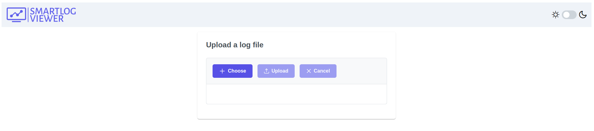
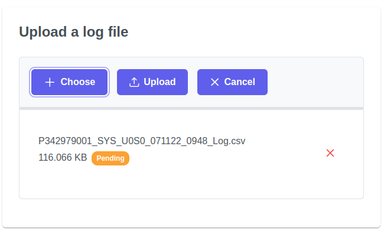
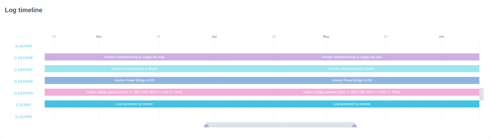

---
title: "Manuale Utente"
date: "01/04/2023"
responsabile: "Antonio Stan"
redattori: ["Andrea Auletta", "Enrik Rucaj", "Mattia Brunello"]
verificatori: ["Nicola Cecchetto", "Davide Vitagliano", "Augusto Zanellato"]
abstract: "Viene definito il manuale utente dei programmi SL-Viewer e SL-Statistics."
docusage: "Interno"
toc: true
versioni:
  v0.0.1:
    autore: Mattia Brunello
    data: 01/04/2023
    cambiamenti: Creazione del documento.
  v0.0.2:
    autore: Andrea Auletta
    data: 04/04/2023
    cambiamenti: Inizio manuale di SmartLogViewer
...

# Introduzione

## Scopo del documento

Il presente documento ha lo scopo di descrivere le funzionalità dei programmi SL-Viewer e SL-Statistics. Inoltre, vengono fornite le istruzioni per l'installazione e l'utilizzo dei programmi.

## Glossario

## Cos'è SL-Viewer

SL-Viewer è un'applicazione web in grado di prendere in input un file di log e di elaborare i dati di quest'ultimo dei mediante grafici.
I log contengono dati sugli errori delle varie unità e sottounità.
Sl-Viewer è in grado, grazie a serie di filtri e ordinamenti, di poter visualizzare i dati nella maniera desiderata.  

## Cos'è Sl-Statistics

Sl-Statistic è un'applicazione web che prende in input un insieme di file di log (dello stesso tipo di SL_Viewer) e elabora i dati di questi ultimi mediante un prospetto che contiene dei dati statistici (medie, ecc.) e mediante dei grafici.

# Requisiti

# Sl-Viewer

Per il corretto funzionamento dell'applicazione è necessario disporre di una connessione ad internet.
<!-- L'applicazione è stata testata sui seguenti browser: -->

# Sl-Statistics

Per il corretto funzionamento dell'applicazione è necessario disporre di una connessione ad internet.
<!-- L'applicazione è stata testata sui seguenti browser: -->

# SmartLog Viewer

## Scelta del file log da analizzare

Appena aperta "SmartLog Viewer" verrà presentata questa pagina:

Quest'ultima è divisa in due parti:

* Intestazione;
* Corpo.

### Intestazione

Nell'intestazione, in alto a sinistra, è presente il **logo** dell'applicazione.
In alto a destra invece c'è un **pulsante** che permette di poter **cambiare il tema** da chiaro a scuro e viceversa.

### Corpo

Nel corpo sono presenti tre bottoni:

* Premendo il bottone **Choose** sarà possibile selezionare dal proprio archivio il file log di eventi da voler analizzare.
Dopo aver scelto il file apparirà sotto i tre bottoni come nella figura successiva.
Premendo la **x** si eliminerà la selezione del file.

* Successivamente per poter viualizzare la schermata di analisi sarà necessario cliccare sul bottone **Upload**;
* Il bottone **Cancel** rimuove il file selezionato per poterne scegliere un altro da analizzare.

## Analisi dei dati

Dopo aver caricato il log si verrà reindirizzati alla seguente pagina:

<!-- Inserire immagine finale di SmartLog Viewer -->

La pagina di analisi è suddivisa nelle seguenti parti:

* Informazioni del log;
* Filtri;
* Grafico tempo/evento;
* Tabella eventi.

### Informazioni del log

Nella sezione delle informazioni del log (Log Informations) vengono presentate quattro informazioni:

* Nome del file;
* PC Timestamp;
* UPS Timestamp;
* Totale eventi avvenuti registrati nel log.

### Filtri

#### Filtro per codice

"Filter by Code" è divisa in tre principali sezioni:

* Bottoni:
  * **Select All**: Seleziona tutti i codici;
  * **Select None**: Deseleziona tutti i codici;
* Barra di ricerca: Tramite la barra di ricerca si potrà cercare il codice desiderato;
* Elenco dei codici degli eventi:
  * Sulla destra è presenta una barra di scorrimento verticale che permette di visualizzare tutti i codici presenti nel file;
  * **Cliccando** su un codice si potrà selezionare(blu chiaro) o deselezionare(blu scuro) l'evento.

#### Filtro per Firmware

Il funzionamento del filtro sul firmware è analogo a quello del filtro sul codice.

#### Filtro per Unit/Subunit

"Filter by Unit/Subunit" è suddivisa in due sezioni principali:

* Bottoni: analoghi ai due filtri precedenti;
* Elenco Unit/SubUnit:
  * È presente una **checkbox** alla sinistra di tutte le Unit/Subunit:
    * Cliccando la checkbox dell'unità principale si deselezioneranno sia quest'ultima che **tutte le sue sottounità**;
    * Cliccando la checkbox della subunit si deselezionerà **solamente la subunit stessa**;
  * Sono presenti, inoltre, alla sinistra di tutte le unità principali delle **frecce** (come quella cerchiata in figura).
  Cliccando queste ultime sarà possibile **espandere (o nascondere)la lista delle unità** per poter vedere tutte le sue subunit.

### Grafico tempo/evento

Nel grafico timeline vengono visualizzati tutti gli eventi e il loro **stato di attività** analizzati nel log.

### Tabella eventi
