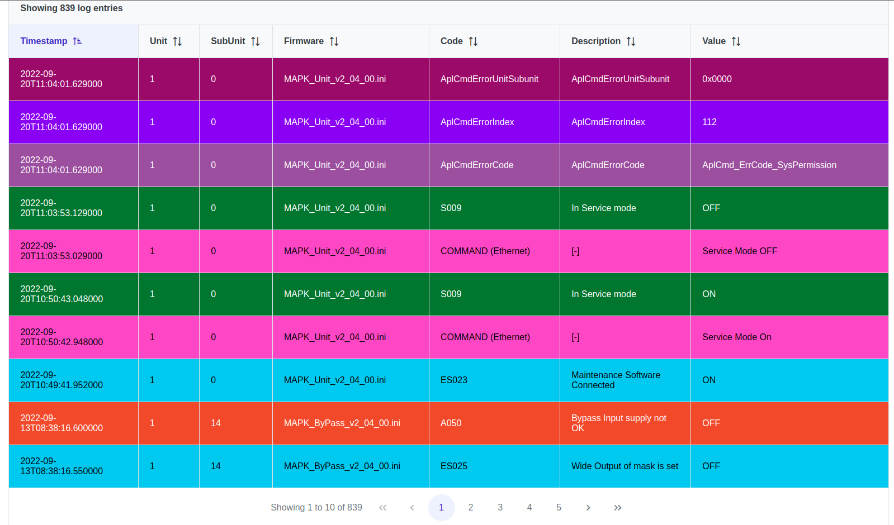
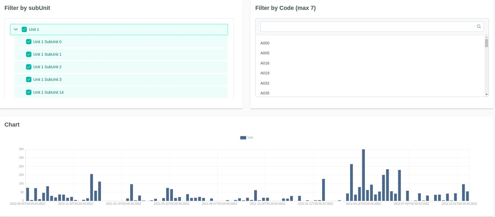
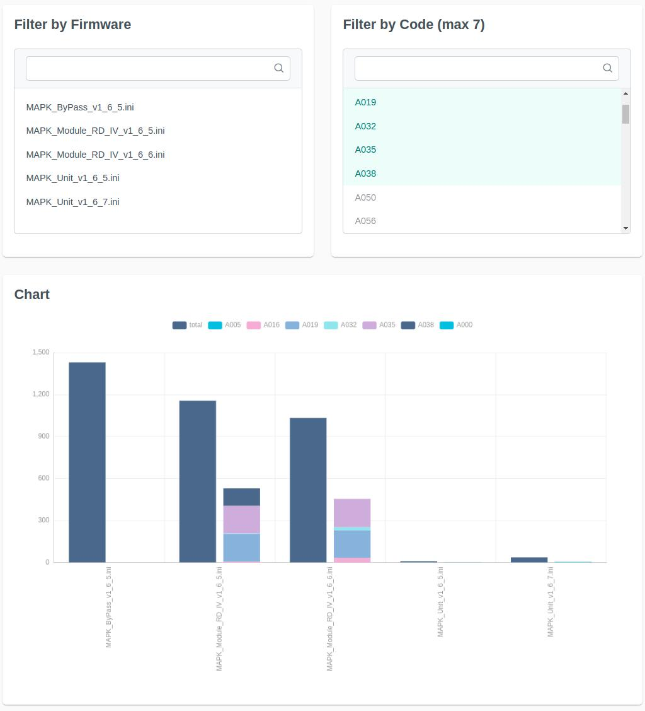

---
title: "Manuale Utente"
date: "01/04/2023"
responsabile: "Antonio Stan"
redattori: ["Andrea Auletta", "Enrik Rucaj", "Mattia Brunello"]
verificatori: ["Nicola Cecchetto", "Davide Vitagliano", "Augusto Zanellato"]
abstract: "Viene definito il manuale utente dei programmi SL-Viewer e SL-Statistics."
docusage: "Interno"
toc: true
versioni:
  v0.0.1:
    autore: Mattia Brunello
    data: 01/04/2023
    cambiamenti: Creazione del documento.
  v0.0.2:
    autore: Andrea Auletta
    data: 04/04/2023
    cambiamenti: Inizio manuale di SmartLogViewer
  v0.0.3:
    autore: Andrea Auletta
    data: 05/04/2023
    cambiamenti: Modificato manuale SmartLogViewer
  v0.0.4:
    autore: Mattia Brunello
    data: 21/04/2023
    cambiamenti: completato manuale SmartLogViewer
  v0.1.0:
    autore: Nicola Cecchetto
    data: 21/04/2023
    cambiamenti: verifica manuale SmartLogViewer
  v0.1.1:
    autore: Enrik Rucaj
    data: 28/04/2023
    cambiamenti: manuale SmartLogStatistics
  v0.2.0:
    autore: Nicola Cecchetto
    data: 02/05/2023
    cambiamenti: verifica manuale SmartLogStatistics
  v1.0.0:
    autore: Antonio Stan
    data: 06/06/2023
    cambiamenti: Approvazione per il rilascio
...

# Introduzione

## Scopo del documento

Il presente documento ha lo scopo di descrivere le funzionalità dei programmi SL-Viewer e SL-Statistics. Inoltre, vengono fornite le istruzioni per l'installazione e l'utilizzo dei programmi.

## Glossario

## Cos'è SL-Viewer

SL-Viewer è un'applicazione web in grado di prendere in input un file di log e di elaborare i dati di quest'ultimo dei mediante grafici.
I log contengono dati sugli errori delle varie unità e sottounità.
Sl-Viewer è in grado, grazie a serie di filtri e ordinamenti, di poter visualizzare i dati nella maniera desiderata.  

## Cos'è Sl-Statistics

Sl-Statistic è un'applicazione web che prende in input un insieme di file di log (dello stesso tipo di SL_Viewer) e elabora i dati di questi ultimi mediante un prospetto che contiene dei dati statistici (medie, ecc.) e mediante dei grafici.

# Requisiti

# Sl-Viewer

Per il corretto funzionamento dell'applicazione è necessario disporre di una connessione ad internet.
<!-- L'applicazione è stata testata sui seguenti browser: -->

# Sl-Statistics

Per il corretto funzionamento dell'applicazione è necessario disporre di una connessione ad internet.
<!-- L'applicazione è stata testata sui seguenti browser: -->

# SmartLog Viewer

## Scelta del file log da analizzare

Appena aperta "SmartLog Viewer" verrà presentata questa pagina:

Quest'ultima è divisa in due parti:

* Intestazione;
* Corpo.

### Intestazione

Nell'intestazione, in alto a sinistra, è presente il **logo** dell'applicazione.
In alto a destra invece c'è un **pulsante** che permette di poter **cambiare il tema** da chiaro a scuro e viceversa.

### Corpo

Nel corpo sono presenti tre bottoni:

* Premendo il bottone **Choose** sarà possibile selezionare dal proprio archivio il file log di eventi da voler analizzare.
Dopo aver scelto il file apparirà sotto i tre bottoni come nella figura successiva.
Premendo la **x** si eliminerà la selezione del file.

* Successivamente per poter viualizzare la schermata di analisi sarà necessario cliccare sul bottone **Upload**;
* Il bottone **Cancel** rimuove il file selezionato per poterne scegliere un altro da analizzare.

## Analisi dei dati

Dopo aver caricato il log si verrà reindirizzati alla seguente pagina:

<!-- Inserire immagine finale di SmartLog Viewer -->

La pagina di analisi è suddivisa nelle seguenti parti:

* Intestazione;
* Informazioni del log;
* Filtri;
* Grafico tempo/evento;
* Tabella eventi.

### Intestazione

L'unica cosa che cambia con l'intestazione della pagina precedente è la comparsa del bottone **Upload another log**.
Cliccando su quest'ultimo si ritornerà alla schermata precedente e sarà possibile caraicare un nuovo file log.

### Informazioni del log

Nella sezione delle informazioni del log (Log Informations) vengono presentate quattro informazioni:

* Nome del file;
* PC Timestamp;
* UPS Timestamp;
* Totale eventi avvenuti registrati nel log.

{width=50%}

### Filtri

#### Filtro per codice

{width=50%}

"Filter by Code" è divisa in tre principali sezioni:

* Bottoni:
  * **Select All**: Seleziona tutti i codici;
  * **Select None**: Deseleziona tutti i codici;
* Barra di ricerca: Tramite la barra di ricerca si potrà cercare il codice desiderato;
* Elenco dei codici degli eventi:
  * Sulla destra è presenta una barra di scorrimento verticale che permette di visualizzare tutti i codici presenti nel file;
  * **Cliccando** su un codice si potrà selezionare(blu chiaro) o deselezionare(blu scuro) l'evento.

#### Filtro per Firmware

{width=50%}

Il funzionamento del filtro sul firmware è analogo a quello del filtro sul codice.

#### Filtro per Unit/Subunit

"Filter by Unit/Subunit" è suddivisa in due sezioni principali:

* Bottoni: analoghi ai due filtri precedenti;
* Elenco Unit/SubUnit:
  * È presente una **checkbox** alla sinistra di tutte le Unit/Subunit:
    * Cliccando la checkbox dell'unità principale si deselezioneranno sia quest'ultima che **tutte le sue sottounità**;
    * Cliccando la checkbox della subunit si deselezionerà **solamente la subunit stessa**;
  * Sono presenti, inoltre, alla sinistra di tutte le unità principali delle **frecce** (come quella cerchiata in figura).
  Cliccando queste ultime sarà possibile **espandere (o nascondere)la lista delle unità** per poter vedere tutte le sue subunit.

#### Filtro per Data

Nel filtro per data compaiono due caselle **"Calendar"**.
I calendari saranno impostati sulla prima e sull'ultima data presenti nell'insieme degli eventi.
Cliccando sulle caselle sarà possibile modificare le due date per filtrare poi gli eventi presenti nel log.

#### Filtro per Sequenza di eventi

Il filtro è diviso in tre sezioni:

* Eventi di chiusura della sequenza:
  * Bisognerà inserire nelle apposite caselle di testo il codice dell'evento e il valore di quest'ultimo e premere il pulsante **Add** per tener conto di quest'ultimo evento che comparirà al di sotto delle caselle.
  * Alla sua destra sono presenti i pulsanti di "modifica" e di "eliminazione" mentre a sinistra è presente il pulsante di "ordinamento" che funziona tramite drag and drop.
  * Sarà possibile poi inserire nuovi eventi seguendo la stessa procedura;
* Eventi di apertura della sequenza:
  * Il funzionamento è analogo a quello degli eventi di chiusura della sequenza;
* Intervallo di tempo dal primo all'ultimo evento da ricercare:
  * È presente una casella di testo dove inserire l'intervallo di tempo desideratoto.

### Grafico tempo/evento

Nel grafico timeline vengono visualizzati tutti gli eventi e il loro **stato di attività** analizzati nel log.

È possibile effettuare scroll, span e zoom sul grafico.

* **Scroll e span** si possono effettuare spostando rispettivamente la barra verticale e quella orizzontale;
* Per effettuare lo **zoom (in e out)** cliccare e trascinare uno dei cerchietti verdi situati agli estremi della barra orizzontale verso destra o sinistra.

### Tabella eventi

La tabella presenta sette colonne.
Cliccando sulle intestazioni delle colonne sarà possibile effettuare **l'ordinamento (crescente, decrescente, d'ingresso)** delle righe della tabella in base alla colonna desiderata.
Nell'intestazione compare anche il numero di eventi selezionati (varia in base alle scelte effettuate nei filtri).
In basso, invece, vengono visualizzata la paginazione della tabella: in ogni pagina di tabella vengono visualizzati dieci eventi alla volta.
Per cambiare pagina si può:

* Cliccare sulle frecce:
  * Singola: ci si sposta di una pagina;
  * Doppie: ci si sposta alla prima (verso sinistra) o all'ultima pagina (verso destra).
* Cliccare sul numero attribuito alla pagina.

# SmartLog Statistics

## Prima apertura

L'applicazione SmartLog Statistics aperta per la prima volta (quindi senza log caricati) mostrerà questa schermata:

Come è possibile notare le schede "Entrues Frequency", "Time/Occurrences Chart" e "Firmware/Occurences Chart" non sono accessibili perchè non sono stati caricati dei log.

## Uploaded Log List

La schermata presenta due pulsanti nella parte alta dello schermo:

* Refresh, che esegue un aggiornamento dei log presenti nel sistema;
* Upload a Log, che come suggerisce il nome permette di caricare un file di log tramite esplora risorse.

Se si prova a caricare un log già nel sistema oppure un file non valido apparirà un messaggio di errore.

I file di log caricati verranno visualizzati nella tabella presente in questa pagina. Questa tabella mostra nome del file, timestamp del primo ed ultimo evento in ordine cronologico e numero totale di eventi. Inoltre nella tabella è presente per ciascun file il pulsante per eliminarlo dal sistema.

A lato della schermata una volta caricati dei log verranno mostrati questi due pannelli:

* Filter by Datetime, che permette di selezionare quali eventi visualizzare nell'applicazione attraverso un intervallo temporale.
* Log Overview, che è un prospetto contenente il numero totale di eventi, il numero medio per file, la deviazione standard, e il numero massimo di eventi trovati in un log (con nome del log suddetto).

## Entries Frequency

Questa schermata presenta la lista di occorrenza eventi. Questa tabella mostra il numero di eventi dati firmware e codice dell'evento.
È possibile ordinare questa tabella secondo le tre colonne.

È possibile filtrare i firmware da cui prendere gli eventi utilizzando l'apposito menù a tendina.

A lato si trovano due pannelli:

* Filter by Unit/Subunit, dove è possibile filtrare gli eventi selezionando unit e subunit;
* Filter by Datetime, che applica un intervallo temporale ai dati presenti in questa pagina.

## Time/Occurences Chart

Questa schermata mostra il grafico tempo/occorrenze.

Anche qui è possibile filtrare per unit e subunit tramite apposito pannello.

Il grafico all'inizio mostra il numero totale di eventi. È possibile selezionare massimo 7 eventi da poter visualizzare in dettaglio.

## Firmware/Occurences Chart

Questa ultima pagina mostra il grafico che mette in relazione firmware e numero di eventi. L'interfaccia e le interazioni sono le stesse del grafico tempo/occorrenze descritto nella sezione precedente.
